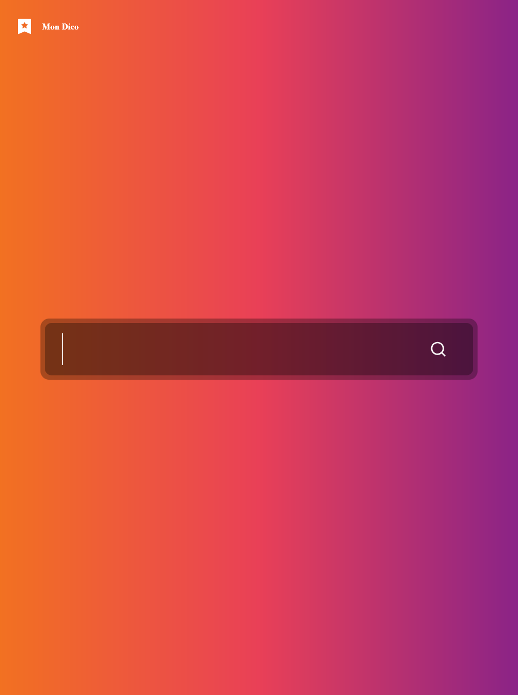
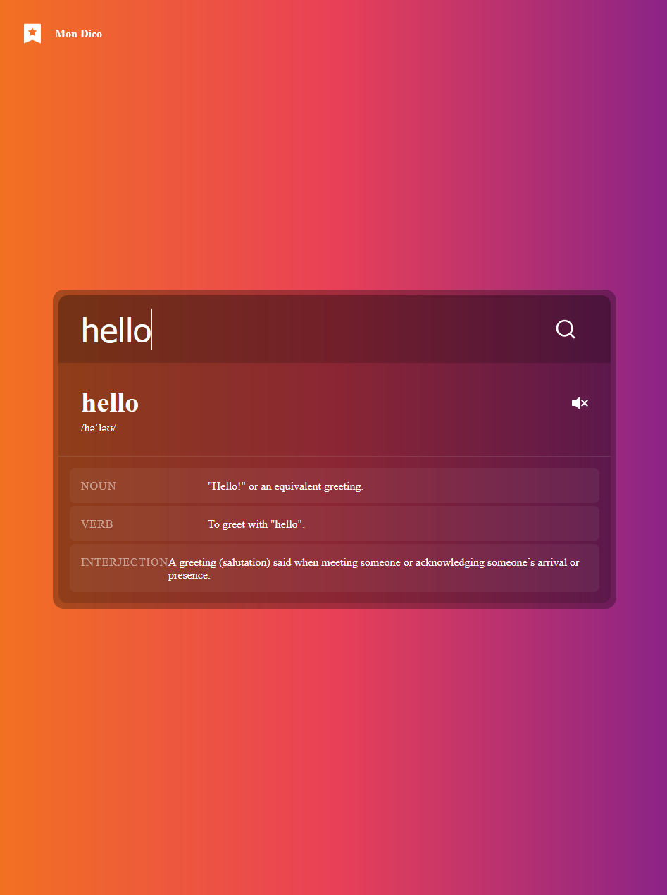

# Mon Dico Anglais

## Description

Ce projet est un dictionnaire interactif en ligne permettant de rechercher des mots en anglais et d'obtenir leurs définitions, prononciations et autres informations pertinentes. Ce projet met l'accent sur l'utilisation de JavaScript pour manipuler le DOM et interagir avec une API externe.

## Fonctionnalités

- **Recherche de mots**: Saisie de mots par l'utilisateur pour obtenir des informations détaillées.
- **Affichage des définitions**: Récupération et affichage des définitions et des phonétiques.
- **Prononciation audio**: Lecture audio de la prononciation des mots.
- **Interface utilisateur dynamique**: Mise à jour dynamique de l'interface utilisateur en fonction des résultats de recherche.

## Technologies Utilisées

- **HTML5**: Structure de la page.
- **CSS3**: Styles et mise en page.
- **JavaScript**: Logique de l'application, manipulation du DOM et interaction avec l'API.

## Notions JavaScript Abordées

### Manipulation du DOM

- **Sélection des éléments**: Utilisation de `document.querySelector` pour sélectionner des éléments du DOM.
- **Écouteurs d'événements**: Ajout d'écouteurs d'événements (`addEventListener`) pour gérer les interactions utilisateur.
- **Modification des éléments**: Mise à jour du contenu des éléments DOM avec `textContent` et `innerHTML`.
- **Création dynamique d'éléments**: Utilisation de `document.createElement` et `appendChild` pour ajouter des éléments de manière dynamique.

### Appels API

- **Fetch API**: Utilisation de `fetch` pour envoyer des requêtes HTTP à l'API de dictionnaire (https://dictionaryapi.dev).
- **Traitement des réponses**: Conversion des réponses en JSON avec `response.json()` et manipulation des données reçues.

### Gestion des Promesses

- **Then et Catch**: Chaînage des méthodes `then` et `catch` pour gérer les promesses et les erreurs lors des appels API.

### Structures de Données

- **Objets et Tableaux**: Manipulation des objets et des tableaux pour stocker et traiter les informations récupérées de l'API.

## Installation et Utilisation

1. Cloner le dépôt ou télécharger les fichiers.
2. Ouvrir le fichier `index.html` dans un navigateur web.
3. Saisir un mot dans le champ de recherche et appuyer sur le bouton de soumission pour voir les informations sur le mot.

## Fichiers du Projet

- `index.html`: Structure de la page web.
- `style.css`: Styles pour la mise en page et l'apparence.
- `script.js`: Logique JavaScript pour l'interaction et le comportement du dictionnaire.
